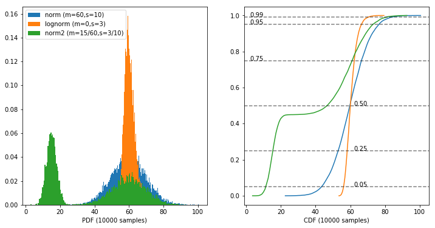
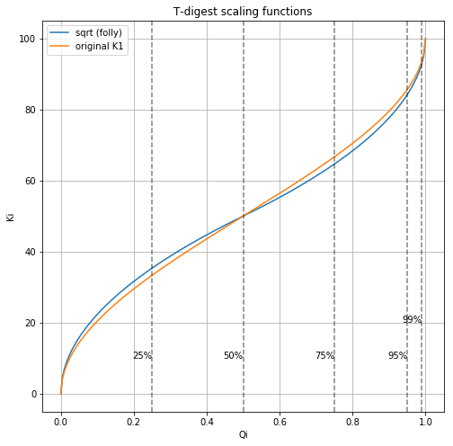

RT-Stat
=======
Set of algorithms, used for estimation statistic characteristics on streaming data.

License: MIT

## 1. References

 - [P-sqared]: R. Jain and I. Chlamtac. (1986) "The P 2 algorithm for dynamic calculation of quantile and histograms without storing observations. Communications of the ACM."
 - [P-sqared-extended]: Kimmo E. E. Raatikainen. (1987) "Simultaneous estimation of several percentiles. SIMULATION"
 - [T-digest]: Dunning, T., Ertl, O. (2014) “Computing Extremely Accurate Quantiles Using t-Digests”

[P-sqared]: https://www.cse.wustl.edu/~jain/papers/ftp/psqr.pdf
[P-sqared-extended]: https://pdfs.semanticscholar.org/159f/598c0b7efc7d1fabbcc1362dbfe1e2e91926.pdf?_ga=2.233713565.2046442882.1566903823-1514905589.1566903823
[T-digest]: https://github.com/tdunning/t-digest/blob/master/docs/t-digest-paper/histo.pdf

## 2. Requirements

CMake >= 3.1

## 3. List of algorithms

### 3.1. Quantile estimation

For test we used three different distribution:
- Normal
- Log-normal
- Concatenation of two normal with rates 45:55

Overall table:

#### 3.1.1. Extended P-Sqared

Normal Distribution: 10k samples

|quantile|O|P^2|
|--------|---|---|
|0.2500|52.9836|52.9851|
|0.5000|59.9277|59.9154|
|0.7500|66.5162|66.5038|
|0.9500|76.1618|76.1764|
|0.9900|82.4665|82.4827|
|0.9990|89.8849|89.5684|

Ordinary statistics RMSE: 0.016831

Log-normal Distribution: 10k samples

|quantile|O|P^2|
|--------|---|---|
|0.2500|58.1564|58.1564|
|0.5000|59.9978|59.9985|
|0.7500|62.3469|62.3442|
|0.9500|66.3513|66.3564|
|0.9900|70.3067|70.3616|
|0.9990|75.5014|75.7077|

Ordinary statistics RMSE: 0.007599

### 3.1.2. T-digest

The scaling function different from original paper is used (borrowed from implementation of [folly](https://github.com/facebook/folly) T-digest)

Clustering algorithm with delta=30, K=3

Normal Distribution: 10k samples

|quantile|O|T-digest|
|--------|---|---|
|0.2500|52.9836|52.9787
|0.5000|59.9277|59.9392
|0.7500|66.5162|66.4970
|0.9500|76.1618|76.1881
|0.9900|82.4665|82.5131
|0.9990|89.8849|90.3902

Ordinary statistics RMSE: 0.043114

Log-normal Distribution: 10k samples

|quantile|O|T-digest|
|--------|---|---|
|0.2500|58.1564|58.1645
|0.5000|59.9978|59.9928
|0.7500|62.3469|62.3377
|0.9500|66.3513|66.3247
|0.9900|70.3067|70.2080
|0.9990|75.5014|76.0272

RMSE: 0.047841
